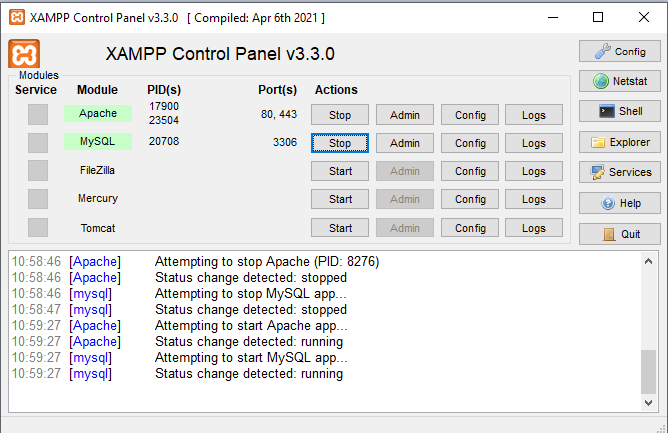
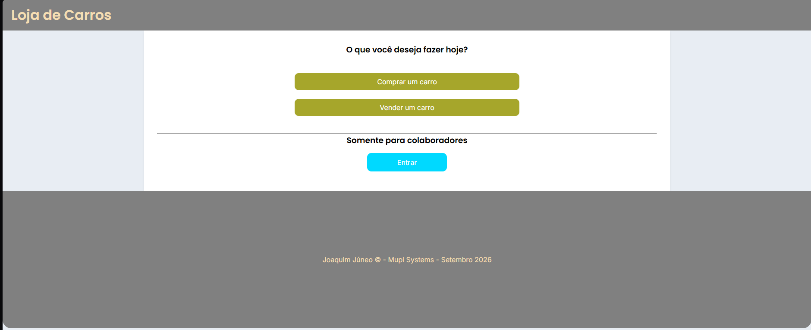
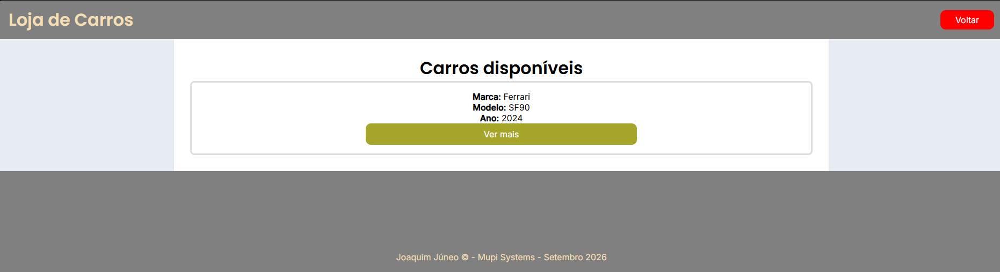
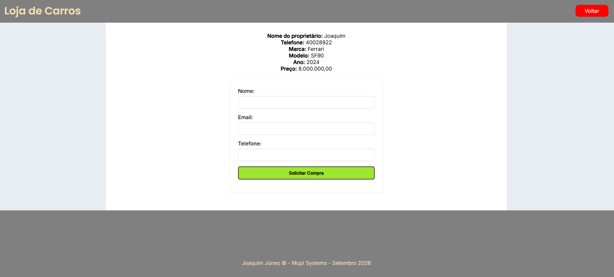
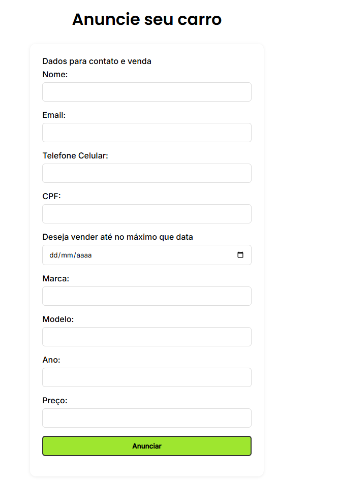
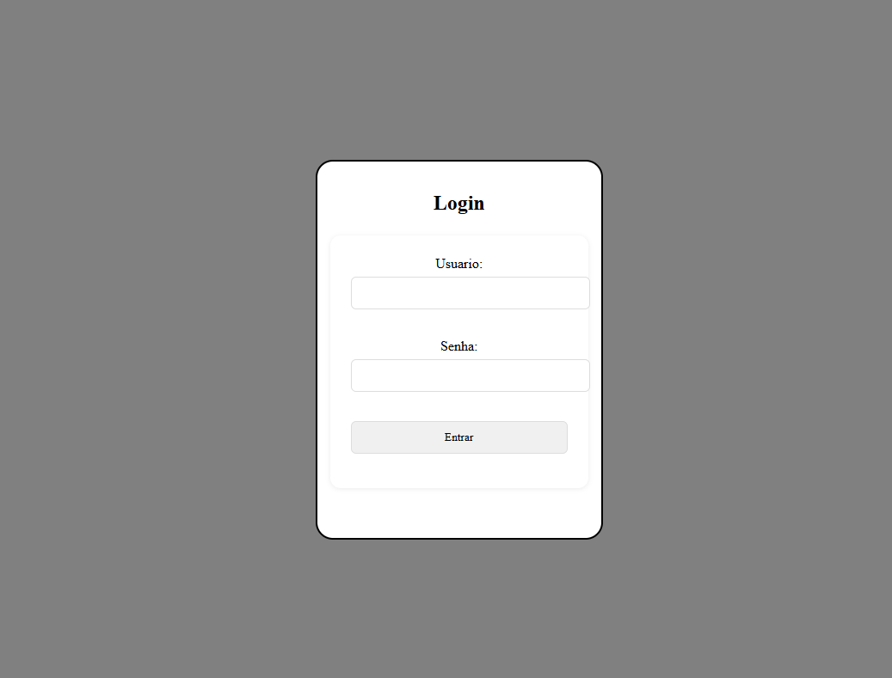
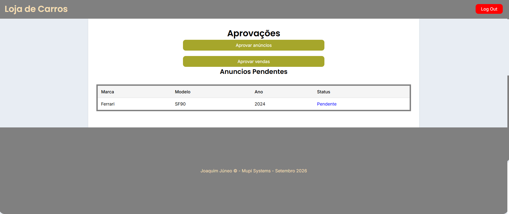
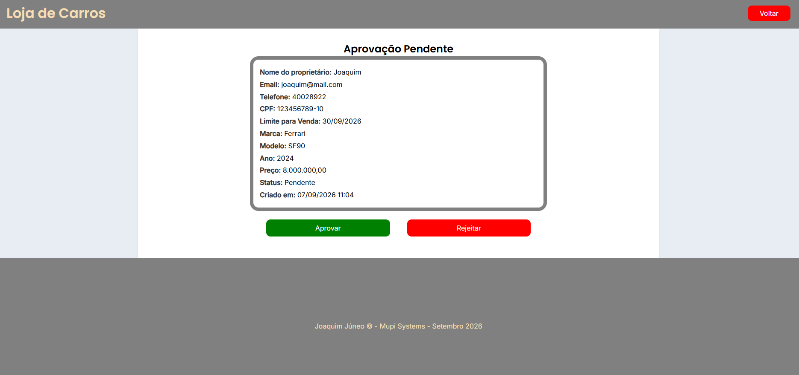

## DESCRIÇÃO DO PROJETO:
Esse projeto implementa um site para uma loja de carros. Permite para usuários públicos: anunciar carros para venda e comprar carros cujo anúncio foi aprovado. Permite a 
administradores: aprovar anúncios e solicitações de compra feitos por parte dos usuários públicos.

## STACK:
- HTML, CSS, PHP
- MySQL/MariaDB (via XAMPP), e o ORM RedBean
> ⚠️ Credenciais fixas apenas para fins de demonstração/avaliação do teste técnico.

## PASSO A PASSO PARA RODAR:
Para rodar esse site é necessário um servidor local, que você pode usar o de sua preferência, no entanto no desenvolvimento foi utilizado o Apache, por meio do XAMPP
Control Panel, o qual darei o passo a passo de como executar a seguir:  
1. Baixe a versão 8.0.30 do XAMPP Control Panel no seguinte link [apachefriends.org](https://www.apachefriends.org/pt_br/download.html) 
2. Após baixar execute o instalador, seguindo em todas as telas; 
3. Depois que o XAMPP estiver instalado, será criado no seu disco principal uma pasta com nome "xampp" com várias outras pastas dentro. Abra a pasta xampp e dentro dela 
abra a pasta de nome "htdocs". Cole a pasta "projeto_estagio_2026_2" dentro de htdocs.
Pronto, a pasta do projeto ja está pronta para rodar no seu servidor local.

Para configuração do banco de dados:
1. Abra o XAMPP control panel, na seção Module estará listado todas as funcionalidades do XAMPP, a que nos interessa no momento é o MySQL, à frente de MySQL, na seção
Actions, clique em "Start";
2. Após isso, clique em "Shell" que está na coluna de opções do canto esquerdo do painel do XAMPP, irá abrir um prompt de comando;
3. Execute os seguintes comandos:
- `mysql -u root`
- `CREATE DATABASE loja_de_carros;` (aqui o ponto e vírgula faz parte do comando)
Pronto após isso seu bd ja estará pronto também, pode fechar o prompt de comando se desejar.
    
Agora vamos acessar o site, certifique-se de que o Apache também foi iniciado com o Start no XAMPP, igual foi feito com o MySQL.

Para fazer o primeiro acesso ao site utilize o seguinte link em seu navegador:
http://127.0.0.1/projeto_estagio_2026_2/cargainicial.php
É importante acessar primeiro por cargainicial.php, pois lá que é criado o usuário admin.
Após isso, será redirecionado ao index.php, que é a home da página da loja de carros, e nos acessos posteriores pode se usar o link:
http://127.0.0.1/projeto_estagio_2026_2/index.php

## COMO USAR O SITE:
Uma vez no index.php, você verá a página home, e nela terá 3 botões, indicando 3 caminhos possíveis para seguir, que explicarei a seguir:

- Botão "Comprar um carro" te levará a uma página com todos os anúncios aprovados, para que se possa escolher um carro e comprar, todos os anúncios terão um botão 
"Ver mais", que te leva a página de finalização de compra, no qual é mostrada todas as informações do veículo, e tem um formulário com informações de contato do 
comprador, o qual deve ser preenchido para solicitar a compra do veículo, que posteriormente será aprovada ou rejeitada por um admin.

- Botão "Vender um carro" te levará a uma página com um formulário com informações do vendedor e do carro a ser vendido, o qual devem ser preenchidas para anunciar
o carro para venda, anúncio esse que deve ser aprovado por um admin. Aqui vale ressaltar que não há anuncios pré aprovados no carregamento do site, então para aparecer anúncios na aba de compras, devem ser anunciados por aqui e aprovados nos passos seguintes.

- Botão "Entrar" te leva a tela de login, que deve ser feito com as credenciais do usuário admin, que são:
Usuário: root
Senha: qwerty

Após entrar você será levado a tela para ver os anúncios e vendas pendentes, que terá 2 botões:
- Botão "Aprovar anúncios" lhe mostrará uma tabela com todos os anúncios que o status é "Pendente"
- Botão "Aprovar vendas" lhe mostrará uma tabela com todos as vendas que o status é "Solicitado"

Para aprovar o anúncio ou a venda o processo é o mesmo para ambos, ao clicar no status você será levado a uma tela de aprovação com todos os dados do anúncio ou da 
venda, e nessa tela terá os botões de "Aprovar" ou "Rejeitar" para aprovar ou rejeitar a ação em questão. Apenas os anuncios aprovados aqui aparecerão na aba de 
compras;

Pronto! Agora você está preparado para rodar e operar o site!